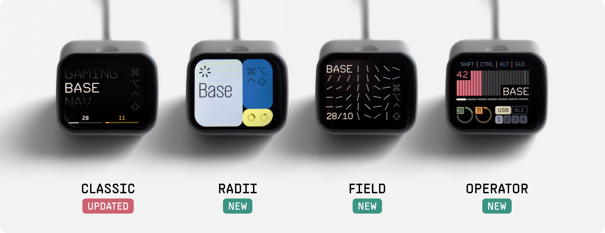

# Prospector ZMK Module

This is a [ZMK module](https://zmk.dev/docs/features/modules) that provides custom status screen support for the [Prospector](https://github.com/carrefinho/prospector) display dongle.



> [!IMPORTANT]
> This branch is a work-in-progress and is only compatible with the Zephyr 4.1 version of ZMK (current main).

## Features

- Four status screen layouts to choose from
- Active layer display
- Peripheral battery status
- BLE profile and output indicator
- Active modifier display
- Caps word indicator

## Installation

Your ZMK keyboard should be set up with a dongle as central.

Add this module to your `config/west.yml` with these new entries under `remotes` and `projects`:

```yaml
manifest:
  remotes:
    - name: zmkfirmware
      url-base: https://github.com/zmkfirmware
    - name: carrefinho                            # <--- add this
      url-base: https://github.com/carrefinho     # <--- and this
  projects:
    - name: zmk
      remote: zmkfirmware
      revision: main
      import: app/west.yml
    - name: prospector-zmk-module                 # <--- and these
      remote: carrefinho                          # <---
      revision: feat/new-status-screens           # <---
  self:
    path: config
```

Then add the `prospector_adapter` shield to the dongle in your `build.yaml`:

```yaml
---
include:
  - board: xiao_ble
    shield: [YOUR KEYBOARD SHIELD]_dongle prospector_adapter
```

For more information on ZMK Modules and building locally, see [the ZMK docs page on modules.](https://zmk.dev/docs/features/modules)

## Status Screens

Classic is used by default. To choose a different screen, add one of the following to your `.conf` file:

```ini
CONFIG_PROSPECTOR_STATUS_SCREEN_RADII=y
CONFIG_PROSPECTOR_STATUS_SCREEN_FIELD=y
CONFIG_PROSPECTOR_STATUS_SCREEN_OPERATOR=y
```

## Usage

For split keyboards, the peripheral battery widget arranges sub-widgets in pairing order. After flashing the dongle, pair the left side first, then the right side. For more than two peripherals, pair them left to right.

The layer display shows the `display-name` property when available, falling back to the layer index otherwise. To add a `display-name` to a keymap layer:

```dts
keymap {
  compatible = "zmk,keymap";
  base {
    display-name = "Base";           # <--- add this
    bindings = <
      ...
    >;
  }
}
```

## Configuration

To customize, add config options to your `.conf` file:
```ini
CONFIG_PROSPECTOR_USE_AMBIENT_LIGHT_SENSOR=n
CONFIG_PROSPECTOR_FIXED_BRIGHTNESS=80
```

### General
| Name | Description | Default |
| ---- | ----------- | ------- |
| `CONFIG_PROSPECTOR_ROTATE_DISPLAY_180` | Rotate the display 180 degrees | n |
| `CONFIG_PROSPECTOR_USE_AMBIENT_LIGHT_SENSOR` | Use ambient light sensor for auto brightness | y |
| `CONFIG_PROSPECTOR_FIXED_BRIGHTNESS` | Fixed display brightness when not using ambient light sensor | 50 (1-100) |
| `CONFIG_PROSPECTOR_LAYER_NAME_UPPERCASE` | Convert layer names to uppercase (Operator and Radii only) | y |

### Modifiers
| Name | Description | Default |
| ---- | ----------- | ------- |
| `CONFIG_PROSPECTOR_SHOW_MODIFIERS` | Display modifier key indicators | y |
| `CONFIG_PROSPECTOR_SHOW_INACTIVE_MODIFIERS` | Show inactive modifiers dimmed (Classic and Field only) | y |
| `CONFIG_PROSPECTOR_MODIFIER_ORDER` | Order of modifiers: G=GUI, A=Alt, C=Ctrl, S=Shift | "GACS" |

### Field-specific
| Name | Description | Default |
| ---- | ----------- | ------- |
| `CONFIG_PROSPECTOR_ANIMATION_WPM_REFERENCE` | WPM value at which animation reaches max speed | 70 |
| `CONFIG_PROSPECTOR_ANIMATION_INTENSITY_DECAY_SEC` | Seconds for lines to fade out after typing stops | 30 |
| `CONFIG_PROSPECTOR_ANIMATION_FLOW_DECAY_SEC` | Seconds for line directions and length to settle | 300 |

## Known Issues

- One peripheral may fail to register key presses after connecting to the dongle; reset the affected peripheral to fix. https://github.com/zmkfirmware/zmk/issues/3156
- Operator, Radii: battery display only supports up to three peripherals

## To-Do

- Operator: per-profile BLE status
- Radii: document and improve color theme customization
- OS-specific modifier styles
- Caps lock indication
